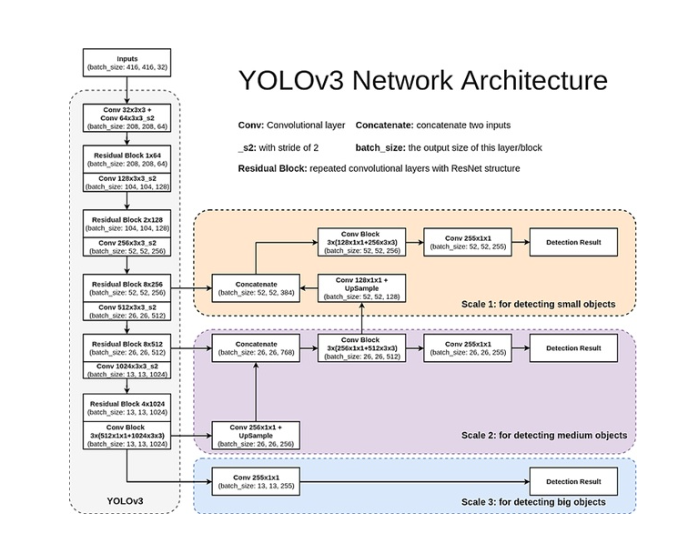
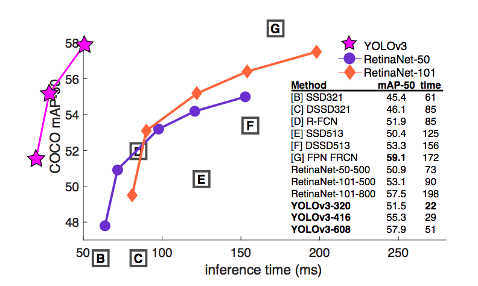
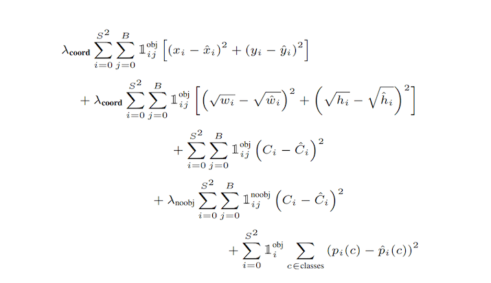

## S11
**Objective: Train YOLO V3 Model with acceptence accuracy and understad the concepts behind object detection and usage of annotation tool.**

Here is the network architecture:

Please refer to below for accuracy comparision:

One of the best Loss function:

Here we are refering this repo(https://github.com/theschoolofai/YoloV3) in order to train our model.

We used 300 images for traininig and 39 for validation and remaning 37 for testing.

For annotation refer: https://github.com/miki998/YoloV3_Annotation_Tool

Number of classes: 1
Class Name: buffalo

We got acceptable accuracy and prediction results also.
Training Logs: 

Some results are shown here: