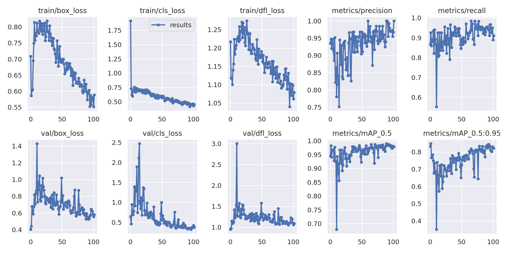
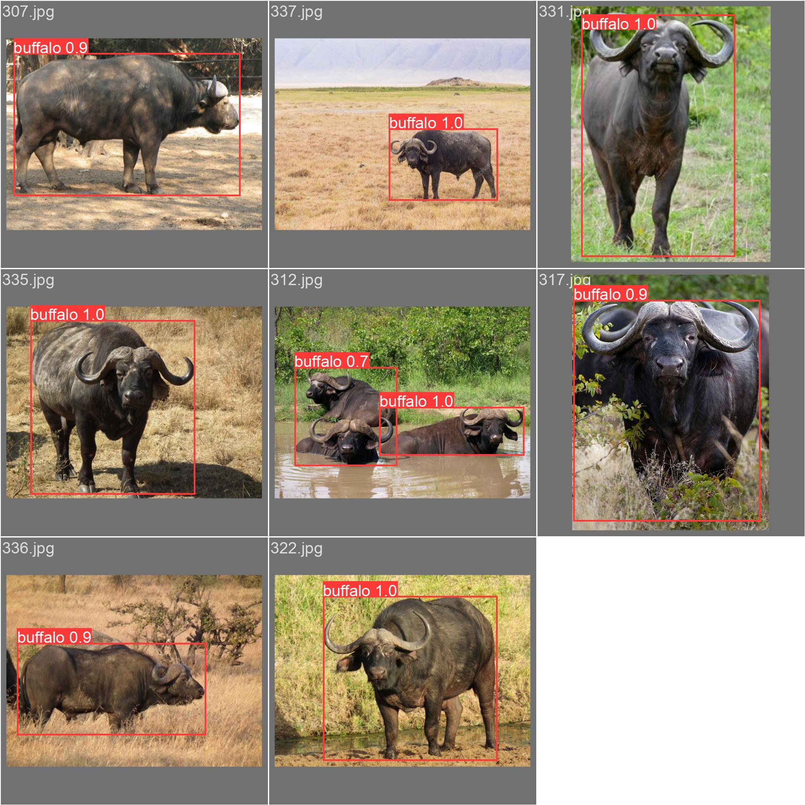

# YOLOv9

Implementation of paper - [YOLOv9: Learning What You Want to Learn Using Programmable Gradient Information](https://arxiv.org/abs/2402.13616)

Referred this repo: https://github.com/SkalskiP/yolov9.git

User can input there images and tryout here: https://huggingface.co/spaces/Vasudevakrishna/ERAV2_S15

Trained custom data with buffalo as object on Azure VM and logs can be seen in nohup.out

Training logs can be visualized as:

Validation results are:

