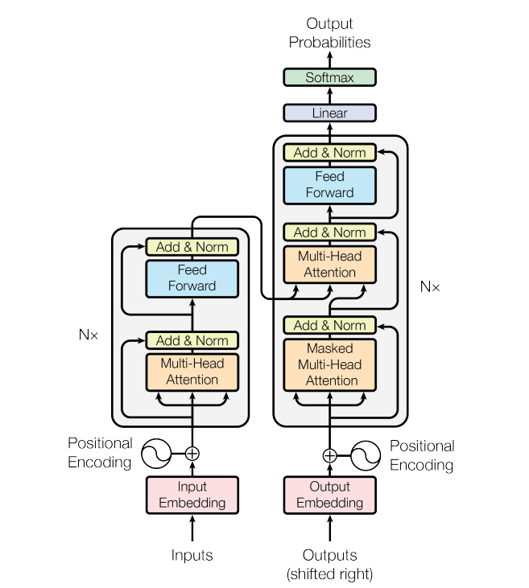

## S17
**Objective: Train english to italian language translation using Basic vanilla transformers and understand the structure of transformers.**

Contstraints:
1. Use Pytorch lightning
2. Train the model for 10 epochs
3. Achieve a loss of less than 4

Number of encoder and decoder blocks used     : 6

Embedding dimension or number of blocks used  : 512

Sequence Length                               : 350

Final Loss achieved                           : 1.4

A transformer architecure can be visualized as:

Please go through the code and comments to get deeper intuitions.