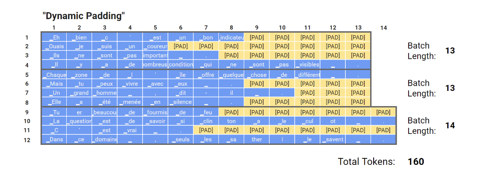
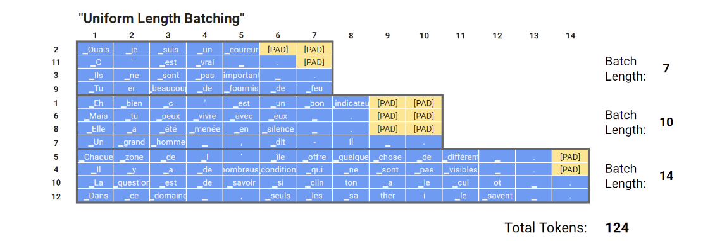
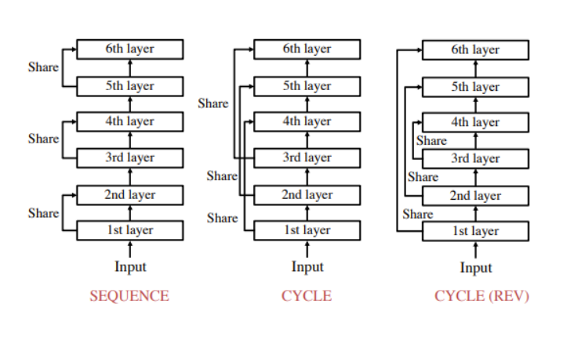

# S18
**Objective: Speeding up the training process of english to french language translation using basic vanilla transformers.**

Contstraints:
1. Pick the "en-it" dataset from opus_books
2. Remove all English sentences with more than 250 "tokens"
3. Remove all french sentences where len(fench_sentences) > len(english_sentrnce) + 10
4. Train your own transformer (E-D) (do anything you want, use PyTorch, OCP, PS, AMP, etc), but get your loss under 1.8s

Number of encoder and decoder blocks used     : 6 

Embedding dimension or number of blocks used  : 512

Sequence Length                               : 250

To Speed up the training process: 
1. Dynamic Padding: Here we limit the number of added pad tokens to reach the length of the longest sequence of each mini-batch instead of a fixed value set for the whole train set Because the number of added tokens changes across mini-batches, we call it "dynamic" padding.

2. Uniform Length Batching: We push the logic further by generating batches made of similar length sequences so we avoid extreme cases where most sequences in the mini-batch are short and we are required to add lots of pad tokens to each of them because 1 sequence of the same mini-batch is very long.

3. Automatic Mixed Precision Package: Numeric Precision Reduction means yielding speedups through the use of floating point reduction and quantization. This is perhaps the most general method for yielding prediction-time speedups.

4. Parameter Sharing: Share the same blocks as shown below.  

We used cycle(Rev) in this code.