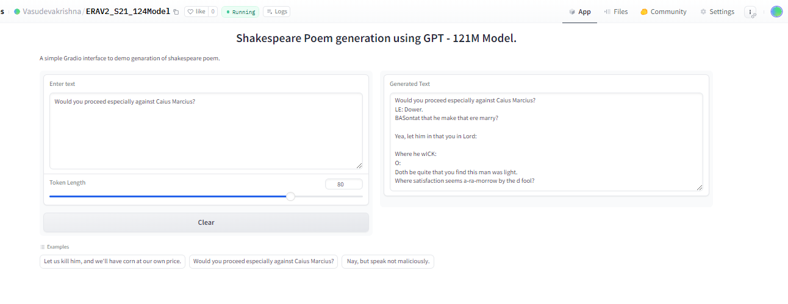

#S20(Part 2)
---

# GPT-2 Shakespeare Model

## Overview

This project involves training a GPT-2 model from scratch using text from the works of William Shakespeare. The model generates text in a Shakespearean style, capturing the unique linguistic patterns and vocabulary of his plays and sonnets.

## Features

- Trained on the complete works of William Shakespeare
- Generates text that mimics Shakespeare's style
- Can be used for creative writing, educational purposes, or as a fun tool to explore language generation

## Usage

You can interact with the model through our Hugging Face app. Simply input a prompt, and the model will generate Shakespearean text based on your input.

[Hugging Face App Link](https://huggingface.co/spaces/Vasudevakrishna/ERAV2_S21_124Model)



## Example Output

Here are some example outputs generated by the model:

**Input:** "To be or not to be, that is the question."

**Output:** 
```
To be or not to be, that is the question.
Whether 'tis nobler in the mind to suffer
The slings and arrows of outrageous fortune,
Or to take arms against a sea of troubles
And by opposing end them. To die: to sleep;
No more; and by a sleep to say we end
The heart-ache and the thousand natural shocks
That flesh is heir to, 'tis a consummation
Devoutly to be wished. To die, to sleep;
To sleep: perchance to dream: ay, there's the rub;
For in that sleep of death what dreams may come
When we have shuffled off this mortal coil,
Must give us pause: there's the respect
That makes calamity of so long life;
```

## Training

The model was trained using the following steps:

1. **Data Preprocessing:** The text data was cleaned and formatted to suit the model's requirements.
2. **Model Configuration:** A GPT-2 model configuration was set up for training.
3. **Training Process:** The model was trained on a high-performance GPU for several epochs until convergence.

## Contributing

We welcome contributions to improve the model or add new features. Feel free to open an issue or submit a pull request.

## License

This project is licensed under the MIT License. 
---