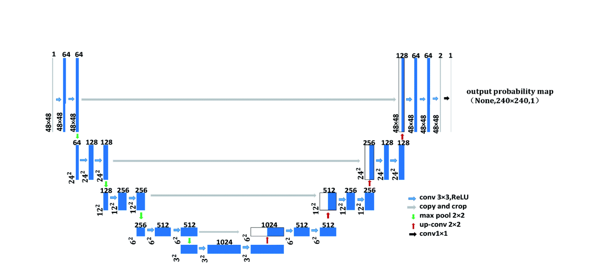
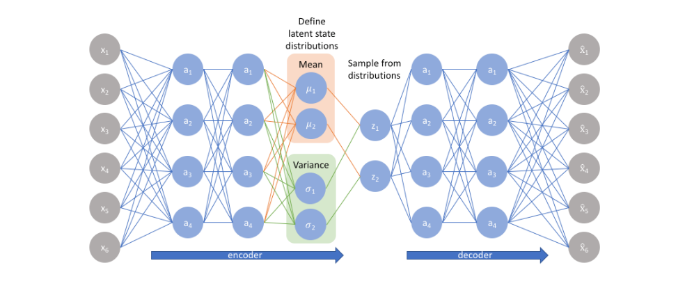

## S21
**Objective: Understand the concept of UNets and VAE.**

Contstraints:
Train UAE on
1. MP(MaxPooling)+Tr(Traspose Convolution)+CE(CrossEntropy)
2. MP+Tr+Dice Loss
3. StrConv+Tr+CE
4. StrConv+Ups+Dice Loss

A typical UNet look like:

Please find all the graphs and models for Unets is this notebook: [UNet Notebook](./unet.ipynb)

Variational Autoencoders (VAEs) have one fundamentally unique property that separates them from vanilla autoencoders, and it is this property that makes them so useful for generative modeling: their latent spaces are, by design, continuous, allowing easy random sampling and interpolation. 

It achieves this by doing something that seems rather surprising at first: making its encoder NOT output an encoding vector of size n, but rather, outputting two vectors of size n: a vector of means μ, and another vector of standard deviations σ!

