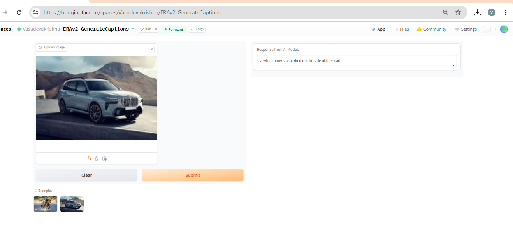

## S22
**Objective: Explore CLIP Model.**

CLIP (Contrastive Language-Image Pre-training) is a model developed by OpenAI that leverages large-scale pre-training on both image and text data to understand the relationship between the two modalities. Unlike traditional computer vision models that rely solely on images or NLP models that process only text, CLIP is trained to associate images and their corresponding textual descriptions in a multimodal framework.

### Understanding CLIP

CLIP is built on the idea of contrastive learning. During training, it is provided with a large dataset of images and their corresponding textual descriptions. The model learns to align images with their relevant text by maximizing the similarity of the correct pairs (image and its description) and minimizing the similarity of incorrect pairs. This results in a powerful model that can perform various tasks by leveraging its understanding of both visual and textual information.

### Applications of CLIP:

1. **Zero-shot image classification**: CLIP can classify images into categories without needing additional training data for those categories. It can generalize to new tasks by understanding the textual descriptions of new classes.
2. **Fine-Tuned Image Classification**: While CLIP excels in zero-shot settings, it can also be fine-tuned on specific datasets for improved performance in particular domains.
3. **Semantic Image Retrieval**: Using textual queries to retrieve relevant images from a database, enabling efficient and intuitive search experiences.
4. **Content Moderation**: Automatically identifying and filtering out inappropriate or harmful content based on visual and textual cues.
5. **Image Ranking**: Ordering images based on their relevance to a given textual description, useful in recommendation systems and search engines.
6. **Image Captioning**: Generating descriptive captions for images by leveraging the learned associations between images and text.
7. **Deciphering Blurred Image**: Enhancing and interpreting low-quality or blurred images by associating them with clearer textual descriptions.
8. **Reverse Image Search**: Finding similar images based on an input image, aiding in various search and discovery applications.

For a practical implementation of CLIP in image captioning, you can explore the HuggingFace app:

HuggingFace App for image captioning: [HuggingFace Image Captioning](https://huggingface.co/spaces/Vasudevakrishna/ERAv2_GenerateCaptions)

A Sample screen shot from hugging face app:

Please go through the code and comments to get deeper intuitions.
