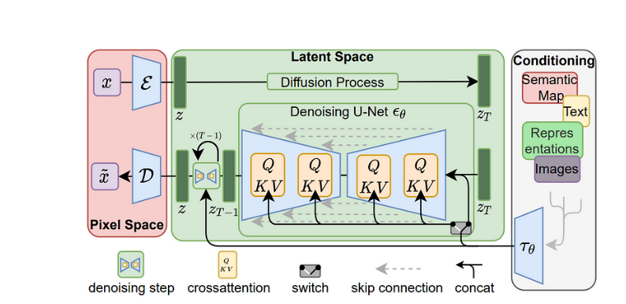

## S24
**Objective: Explore Stable Diffusion.**

Stable Diffusion is based on a particular type of diffusion model called Latent Diffusion, proposed in [! High-Resolution Image synthesis with Latent Diffusion models](https://arxiv.org/abs/2112.10752)

General Diffusion models are trained to denoise random Gaussian noise step by step, but the reverse denoising process is slow and takes a lot of memory because they operate in pixel space. 

Latent diffusion can reduce memory and compute complexity by applying the diffusion process over a lower dimensional latent space. 

There are three main components in latent diffusion:

1. An AutoEncoder (VAE)
2. A UNet
3. A Text-encoder (CLIP)

HuggingFace App: https://huggingface.co/spaces/Vasudevakrishna/ERAV2_S24

Please go through the code and comments to get deeper intuitions.