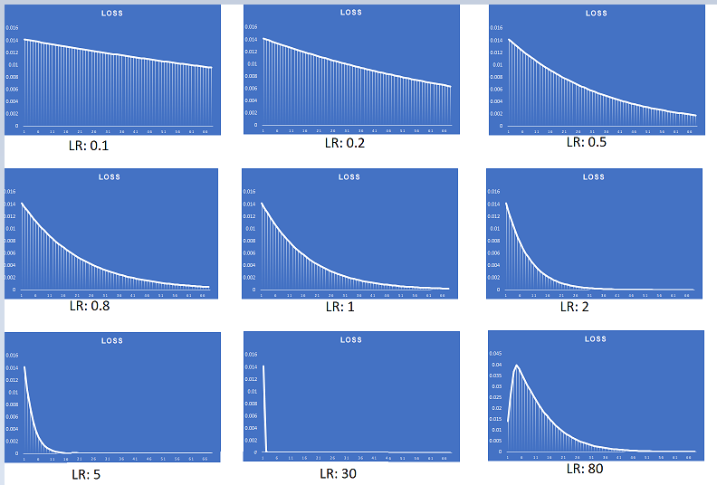

### Part1: Backpropagation
It is used to adjust the weights and biases of the network's connections in order to minimize the error between the predicted output and the desired output. 

During the forward pass of backpropagation, the input data is fed into the neural network, and the network performs a series of computations through its layers to generate an output. The output is then compared to the desired output using a loss function, which quantifies the error or mismatch between the predicted and desired outputs.

Consider a small neural netwrok having two inputs and two outputs and a hidden layer with two neurons. 

#### Notations: 
Inputs  :   i1, i2 
Outputs :   o1, o2 
Weights :   w1, w2, w3, w4, w5, w6, w7, w8 
ACtivation function Outputs : a_h1, a_h2, a_o1, a_o2(Activation function used is sigmoid) 
Hidden Layer outputs: h1, h2 
Error   :   E1, E2, E_total(E1+E2) 

The equations in the forward pass: 
*h1 = w1 \* i1 + w2 \* i2* 		
*h2 = w3 \* i1 + w4 \* i2* 	
*a_h1 = σ(h1) = 1/(1 + exp(-h1))*	 	
*a_h2 = σ(h2)*	 	
*o1 = w5 \* a_h1 + w6 \* a_h2*	 	
*o2 = w7 \* a_h1 + w8 \* a_h2*		 	
*a_o1 = σ(o1)*	 		
*a_o2 = σ(o2)* 			
*E_total = E1 + E2*	 		
*E1 = ½ \* (t1 - a_o1)²*	 		
*E2 = ½ \* (t2 - a_o2)²*	 		

Using the mathematical partial derivative and chaine rule concept, the weights need to be updated can be shown as: 
*∂E_total/∂w1 = ((a_01 - t1) \* a_o1 \* (1 - a_o1) \* w5 +  (a_02 - t2) \* a_o2 \* (1 - a_o2) \* w7) \* a_h1 \* (1 - a_h1) \* i1* 												
*∂E_total/∂w2 = ((a_01 - t1) \* a_o1 \* (1 - a_o1) \* w5 +  (a_02 - t2) \* a_o2 \* (1 - a_o2) \* w7) \* a_h1 \* (1 - a_h1) \* i2* 										
*∂E_total/∂w3 = ((a_01 - t1) \* a_o1 \* (1 - a_o1) \* w6 +  (a_02 - t2) \* a_o2 \* (1 - a_o2) \* w8) \* a_h2 \* (1 - a_h2) \* i1* 											
*∂E_total/∂w4 = ((a_01 - t1) \* a_o1 \* (1 - a_o1) \* w6 +  (a_02 - t2) \* a_o2 \* (1 - a_o2) \* w8) \* a_h2 \* (1 - a_h2) \* i2* 											
∂w7 = (a_02 - t2) \* a_o2 \* (1 - a_o2) \*  a_h1* 					
*∂E_total/∂w8 = (a_02 - t2) \* a_o2 \* (1 - a_o2) \*  a_h2* 					
These are th*∂E_total/∂w5 = (a_01 - t1) \* a_o1 \* (1 - a_o1) \*  a_h1* 					
*∂E_total/∂w6 = (a_01 - t1) \* a_o1 \* (1 - a_o1) \*  a_h2* 				
*∂E_total/e actual updating parameters which are going to update original ramdomly initilized earlier weights. 
Each weight can be updated as: 
*W = W - (LR)/(BS) \* ∂E_total/∂W* where LR is the learning rate and BS is the batch size.  
Hence learning rate determines the step size at each iteration when updating the model's parameters during the training process.  
If the learning rate is too high, the algorithm may overshoot the optimal solution, causing it to diverge or oscillate around the optimum. On the other hand, if the learning rate is too low, the algorithm may converge very slowly, requiring many iterations to reach a satisfactory solution. 

This XL shows how the parameters are changing with respect to Learning rate. You can change inputs and change initialization of weights and you can play around it. 

The image is as below: 

The below image shows, with respect to change in the learning rate how the loss is reducing and how learning rate playing a very important role is getting to the loss minimum 

### Part 2: MNIST Training:

Here we want to train a neural network with less then 20K parameters and to achieve 99.4% accuracy on MNIST dataset. Getting till 99.39 is little easy how recahing at 99.4 is very difficult with given constaints. 
The model is uses 3 blocks which consists of convolutions, maxpool layers, batch normalization, drop out.
The model architecure is: 

----------------------------------------------------------------
        Layer (type)               Output Shape         Param #
            Conv2d-1            [-1, 8, 26, 26]              80
              ReLU-2            [-1, 8, 26, 26]               0
       BatchNorm2d-3            [-1, 8, 26, 26]              16
            Conv2d-4           [-1, 16, 24, 24]           1,168
              ReLU-5           [-1, 16, 24, 24]               0
       BatchNorm2d-6           [-1, 16, 24, 24]              32
         MaxPool2d-7           [-1, 16, 12, 12]               0
              ReLU-8           [-1, 16, 12, 12]               0
           Dropout-9           [-1, 16, 12, 12]               0
           Conv2d-10           [-1, 32, 10, 10]           4,640
             ReLU-11           [-1, 32, 10, 10]               0
      BatchNorm2d-12           [-1, 32, 10, 10]              64
           Conv2d-13             [-1, 32, 8, 8]           9,248
             ReLU-14             [-1, 32, 8, 8]               0
      BatchNorm2d-15             [-1, 32, 8, 8]              64
        MaxPool2d-16             [-1, 32, 4, 4]               0
             ReLU-17             [-1, 32, 4, 4]               0
          Dropout-18             [-1, 32, 4, 4]               0
           Conv2d-19             [-1, 10, 2, 2]           2,890
      BatchNorm2d-20             [-1, 10, 2, 2]              20
          Dropout-21             [-1, 10, 2, 2]               0
        AvgPool2d-22             [-1, 10, 1, 1]               0
----------------------------------------------------------------
Total params: 18,222 
Trainable params: 18,222 
Non-trainable params: 0 
 

This model is able to achieve 99.40% with less than 20K parameters.